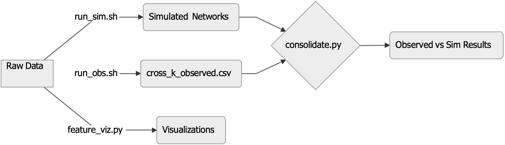
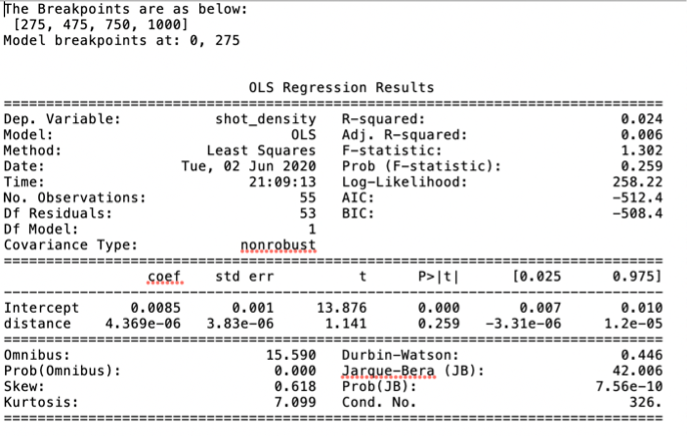
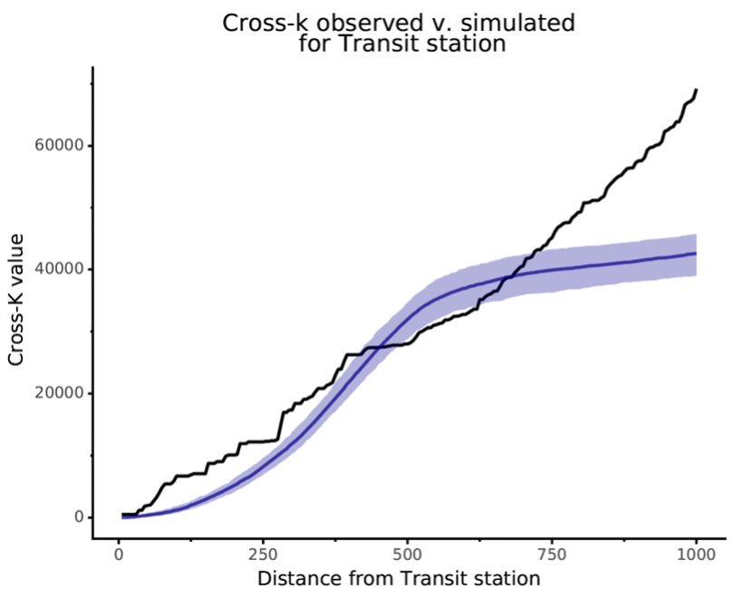
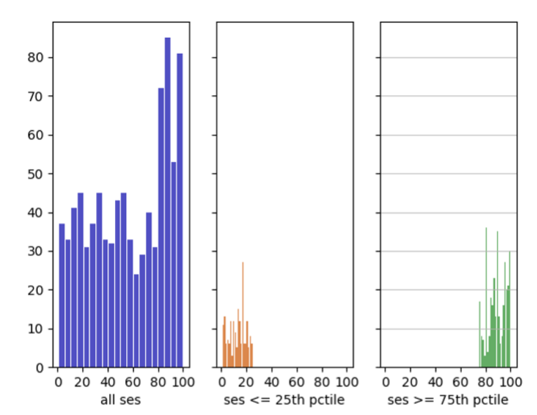

# Quantifying the Attractive and Repellent Influence of Built Environment on Firearms Violence

This is a guide for use of the code created for the manuscript "Accounting for Socio-economic Context in Quantifying the Attractive and Repellent Influence of Built Environment on Firearms Violence in Multiple Cities", which appears in *The Journal of Quantitative Criminology*.

Principal Investigators: 

- Dr. Luke Muggy ([lmuggy\@rand.org](mailto:lmuggy@rand.org)) 
- Dr. Priscillia Hunt

Principal Programmers: 

- Max Griswold ([griswold\@rand.org](mailto:griswold@rand.org)) 
- Florentine (Tyna) Eloundou Nekoul

### Data Sources for Street Network and Embedded Built Environment & Firearms Incident Locations

**Street Network**

-	[OpenStreet Map (2022).](https://openstreetmaps.org/)

**Built Environment & Firearms Data**

-	[City of Detroit. (2019). *City of Detroit Open Data Portal*.](https://data.detroitmi.gov/)  
-	[Allegheny County and the City of Pittsburgh. (2020). The Police Incident Blotter Archive. *Western Pennsylvania Regional Data Center.*](https://data.wprdc.org/dataset/uniform-crime-reporting-data)  
-	[City of Los Angeles. (2020). Crime Data from 2010 to 2019. *Los Angeles Open Data*.](https://data.lacity.org/A-Safe-City/Crime-Data-from-2010-to-2019/63jg-8b9z)  
- [City of New Orleans. (2015). Electronic Police Reports. *Data Driven*.](https://datadriven.nola.gov/home/)  
- [Homeland Infrastructure Foundation-Level Data. (2020a). *Colleges and Universities*.](https://hifld-geoplatform.opendata.arcgis.com/datasets/colleges-and-universities/explore)  
- [Homeland Infrastructure Foundation-Level Data. (2020b). *Public Transit Stations*.](https://hifld-geoplatform.opendata.arcgis.com/datasets/public-transit-stations)
 
### Setup required 
 
Use package_versions.txt as a reference for the package versions we used. One should create a virtual python environment, and in the desired command line, source activate the environment file with the command, with `virtualenv` standing in from the file name:  

```bash
source activate <virtualenv>
```

### Code Flow



### Building the networks

* The **add_points_to_networks.py** script requires the build environment, as well as raw crime data, both in .csv formats, to output a citywide network in a pickle file.  

### Usage

#### Analyzing the networks

* The **est_obs_parallel.py** script requires the city network, to generate:    

  * The shot counts plots, in the format {‘city name’}_shot_counts.pdf  

  * The observed portion of cross-k plots, in the format {‘city name’}_shot_counts.pdf  

  * The piecewise regression plots, in the format {‘city name’}  

  * The observed distance matrices, in the format {‘city name’}_distances_observed.csv  

  * The observed shot count values, in the format {‘city name’}_shot_counts_observed.csv  

  * The observed cross k values, in the format {‘city name’}_cross_k_observed.csv  
  
* The **run_obs** file is a bash script that deploys **est_obs_parallel** in a parallel fashion, taking the city name or prefix as input. Note that **est_obs_parallel** can be run locally, but this architecture allowed us to leverage multiple cores on a Parallel-GNU enabled Linux machine. The syntax is flexible, and one can choose the unit of parallelization.  

* For the four cities, with prefixes LA, DET, PGH, NOLA, the syntax is: 

```bash
parallel 'python est_obs_parallel.py {1}'  ::: "la" "det" "pgh" "nola"
```

  

#### Running the simulations

* The **sim_run_parallel_read.py** file takes as inputs: feature name, iterations, distance range, buffer, ses bounds, breakpoint sensitivity, and a boolean to plot or save results.  

Some sample inputs:  

* features = [‘Convenience Store’] iterations = 10  
* distancerange = 1000  
* buffer = 300  
* ses_lowerbound = 0.0  
* ses_upperbound = 5.0  
* breakpoint_sensitivity = 5 save = True  
* plots = True  

The script outputs cross-k simulated results in the format:

`{city name}_{feature name} _{scenario id}_cross_k_simulated_results.csv.`

The **run_sim_final** file is a bash script that deploys **sim_run_parallel_read** in a parallel fashion, taking the simulation pickle file as well as the inputs above as input. Like **run_obs**, this file is designed to run on a Parallel-GNU enabled Linux machine. The syntax is flexible, and one can choose the unit parallelization.

An example of the syntax is:  
```bash 
parallel 'python sim_run_parallel_read.py "Public pool" 5 1000 300 0 5 5 True'
```  

The call above would call the scenario files 1-10, for the *Public Pool* feature, with 5 iterations, 1000 ft distance range, 300ft buffer, breakpoint sensitivity of 5, and the saving and plotting options activated.  

#### Comparing the simulations to observed

The **consolidate.py** script takes as input:  

* the cross-k results from the simulated networks and the cross-k results from the observed city networks

and outputs:  

* the overlapping plots, named in the format: {city name}_{feature name}_cross_k_observed_v_simulated.pdf  



### Visualization

#### Features

The file **feature_viz** takes as input a city name, and iterates through the list of features, to plot the degree to which a feature fits into the categories of *Attractor*, *Neutral* and *Repellant* over distance.  

The output is a png plot named with the convention: {city name}_degreeviz.png  

  

#### SES

The file **ses_viz** takes as inputs the city name and SES thresholds, to define *High SES* and
*Low SES* and plots, for each feature, histograms of counts within each category and overall.

The output plots are named with the convention: {city name}_feature name_hist.png

  

#### Auxiliary 

The **co_location** file takes as inputs the name of a city, and 2 features, to calculate the observed distances between each combination of instances of the 2 features in a city.

### Feedback

Code critique is welcome. Please send an email to [lmuggy\@rand.org](mailto:lmuggy@rand.org).

Copyright (&copy;) 2022 The RAND Corporation


